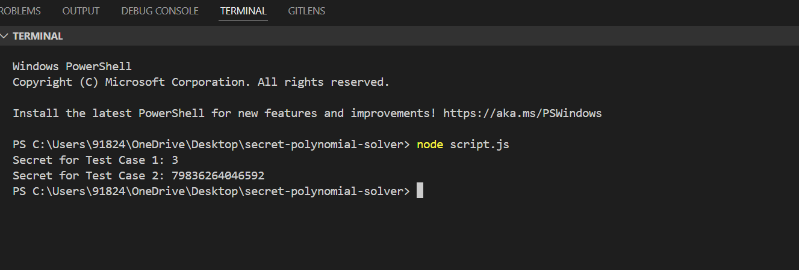

Shamir's Secret Assignment

This project involves finding the constant term (c) of a polynomial using a simplified version of Shamir's Secret Sharing algorithm.

Steps to Run

1. Clone or download the project folder
2. Ensure you have Node.js installed.
3. Navigate to the project folder in the terminal.

Run the script: node script.js

How It Works

1. Input Parsing: Reads input from JSON files (testcase1.json and testcase2.json).
2. Base Conversion: Decodes y values using their respective bases.
3. Polynomial Interpolation: Solves for the constant term (c) using Lagrange interpolation or any other numerical method.
4. Output: Prints the constant term for both test cases.

